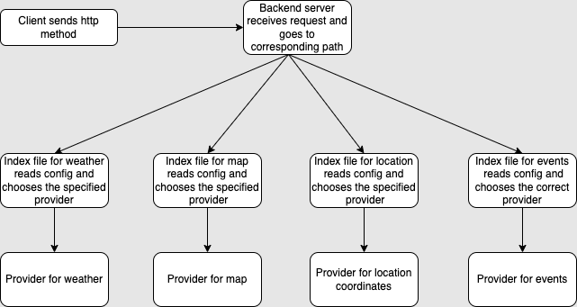
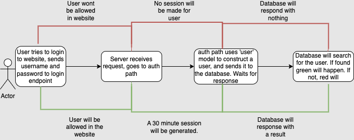
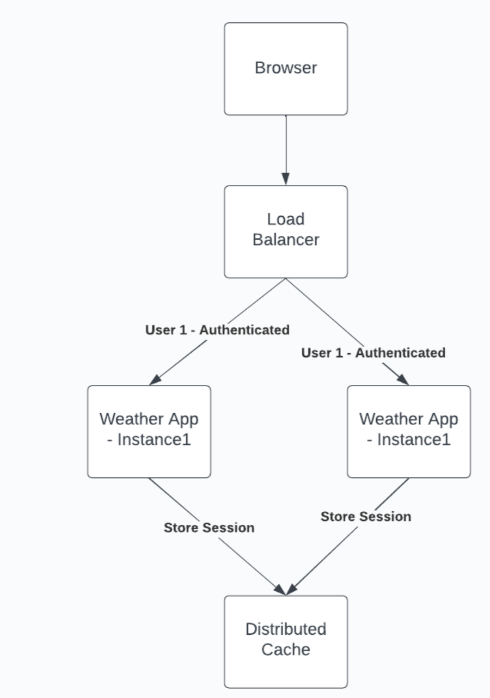
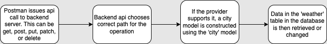
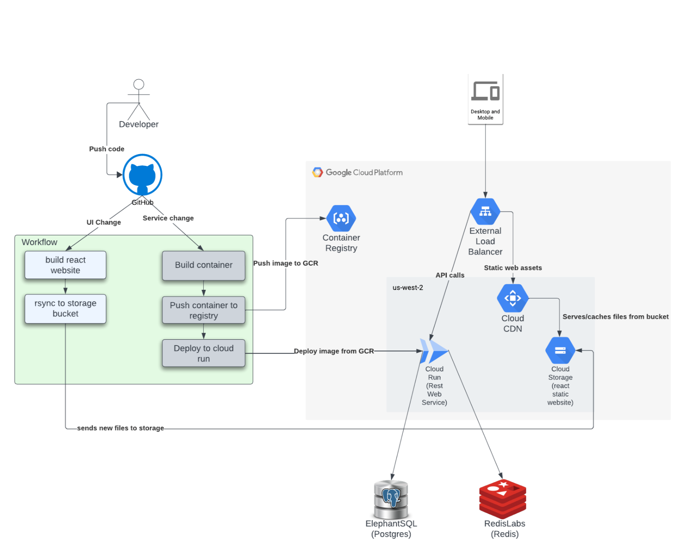

## Project Description
This project was created to learn and apply industry standard software engineering concepts, technology, and design. I did this by building a [website](https://jacktabb.net/) using react.js and node/express js that displays city information. Concepts that I furthered my knowledge in through building this website are:

[Rest Apis, click to see more](#RestAPI)
* My backend is built as a rest api. I did this to make clients such as the front end web pages easily retrieve, modify, or delete data from various resources.

[User authentication and distributed cache, click to see more](#UserA)
* I have user authentication for this website, so if a user wants to gain access to the protected parts of this website, they must either create an account or give a valid username and password 

 [Databases, click to see more](#db)
* I use a postgreSQL database to store user information as well as be a source of weather info. 

[Cloud deployment, click to see more](#cld)
* This website is hosted on google cloud platform.

## Rest apis:

	
Click here to see more about rest api

* My backend is built as a rest api, using node.js and express.js. This involved creating various endpoints to handle different types of requests.
* I have done this to provide a way for clients such as my frontend to use http methods to communicate with components in my backend. 
* I have implemented 5 http methods: get, put, post, delete, and patch. Each endpoint, when called upon, will handle the request accordingly, performing operations such as updating a database with weather information, or a getting static google map of a city.
* Below is a flowchart of my logic. I have organized the backend to efficiently handle these requests.

* This structure allows developers working on the website to easily swich providers for client information. All that has to be done is specify what provider you want in the config file.
* I have also followed this same structure with the user authentication part of my website, more on that below.
* To add a level of proffessionalism to my api, I have added OAS (open api spec) support, the official contract can be viewed [here](https://jtabb1213.github.io/weather/#/). This shows what each endpoint in the api does, what type of method it performs, and the request and response formats.

## User authentication and shared caching:

	
Click here to see more about user authentication and distributed cache

* In order to use the webpage to search for city information, users first must login with a valid username and password. They can also create a new account.
* When the user attempts to login, a request, with the username and password in the body, is sent to the database to confirm that the user is found, which if successful, will make a 30 minute session for the user. This allows the user to access the protected endpoints of the website.

* Additionally, I have added a distributed cache, which stores the user session in a redis store. Now, all user session infomation is in a distributed cache. This is useful because now if I wish to scale up my web application to meet traffic demand, users will not have any authentication issues when switching between instances of my app, as that info will be in a distributed cache.

 

## Databases:

	
Click here to see more about databases

* As mentioned earlier, I have implemented a postgre sql database in this application.
* I did this to store user and weather information. 
* I have added 'city weather' and 'user' models that can be used with the ORM library sequalize to create instances of these models and use them to update or retrieve info from the database.
* To update weather information, I have endpoints in my backend that when called upon, will delete, update, patch, post, or get information in the database. This will obviously only work if the specified provider for weather is the database, so if it is not and you try to do an api call, you will simply get an error message saying 'function is not supported'.

* To update the user information, a very similar apprach is taken only now isntead of using postman to update the database, users will do it when creating their account or logging into the website.

## Cloud deployment:

	
Click here to see more about google cloud deployment

* This application was made accessible by anyone on the internet by deploying it to google cloud. I also had to host the redis store, which was done with redislabs, and host the postgre database, which was done with elephantSQL.

