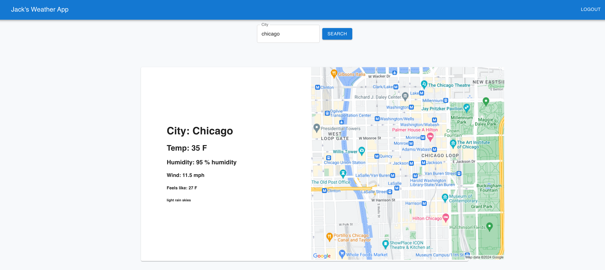

## Project Name & Pitch

Jack’s Weather Webpage 

A web application used to authenticate users and display weather information

## Project Images:

## Installation and Setup Instructions

Clone down this repository. You will need `node` and `npm` installed globally on your machine.  

Installation:

Go to project and run:

‘Npm install’

To Start Server:

`node server.js`  

To Visit App:

‘Npm start’  

## Project Details:

This was a side project for me. Project goals included familiarizing myself with full stack development, user authentication, and databases.

I built the backend of this website in node/express and the frontend in react. I also used a postgre SQL database to store user information, as well as make my own source of weather information.

My front end web page has 3 routes: the root, which renders the AppLayout component and nests the Home component, the “login” route which will direct you to the Login component, and the “register” route which will direct you to the Register component. The Home components allows the user to enter a city name and press search, which will verify they are logged in, and will receive a static google map as well as weather information of the city if they are logged in and the city was found. If they are not logged in, they will be directed to the login page where they can type in their username and password, and press login, or they have the option to create a username and password. The user can also logout, which destroys the session. All of these actions trigger interactions with the backend api, which will act accordingly, either updating information in the database, or sending information back to the frontend.

For my backend, I have created a rest api with various endpoints to handle incoming requests to perform http methods on weather data, location data, and user authentication. To get location data, I use a combination of two google apis to get the coordinates and a static map of the city. To fetch weather data, I currently have three sources. Openweathermap and weatherapi are two apis which I can call to get real time weather information. My third source is a postgre SQL database in which I have a table to store a city's weather information. In my api, I have set up 5 http methods: get, put, post, delete, and patch patch. I can use postman to send an http request to my rest api, triggering the endpoint to update the database with the desired information, such as adding or updating a city. This way, I have become the weather provider. Additionally, I use this database to store user authentication information. When the user attempts to login, their username and password are searched for in the database. I also have an endpoint where users can create a username and password. Upon a successful login, a session is generated for the user, which I have set to be 10 minutes, allowing them access to the protected endpoints in the api. To store this session information, I use shared caching. More specifically, I implemented a redis store to maintain the user session. That way, if I scaled up my web application to have many instances, and the user switched between them, they would still be logged in. 
