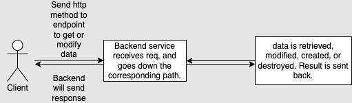

## Project Description
This project was created to learn and apply industry standard software engineering concepts, technology, and design. I did this by building a [website](https://jacktabb.net/) displays city information. The project is broken into 2 main components: backend and frontend.
The backend is a webservice written in nodeJS and expressJS that provides an API interface for the web application. The frontend is a web application written in reactJS that interacts with the backend to display city information. Concepts that I furthered my knowledge through building this website are:

* [Rest Apis](#rest-apis). My backend is built as a rest api. I did this to make clients such as the front end web pages easily retrieve, modify, or delete data from various resources.

* [Authentication and session management](#authentication-and-session-management). I have user authentication for this website, so if a user wants to gain access to the protected parts of this website, they must either create an account or give a valid username and password 

* [Database](#database). I use a postgreSQL database to store user information as well as be a source of weather info. 

* [Cloud deployment](#cloud-deployment). This website is deployed on google cloud platform

* [Software design patterns](#software-design-patterns). This project helped me understand how following a good design pattern is important.

* [Responsive Web Design](#responsive-web-design). Understand and implement a design that looks good on any form factor

## Rest APIs

---
REST APIs are the de facto standard for providing data to help power web applications as well as facilitating connectivity between systems.
RESTful APIs are resource based, so I wanted to expose a few different resources such as weather, local events, and restaurants for a given city to my website.
I followed best practices when creating the API, including syntax, proper usage of http verbs, and documentation. 

* Built on nodeJS and expressJS
* The api specification was written as an open api specification (OAS3) document 
* Integrated with the express-openapi to make request validation easy and dispatching to handlers simple
* The APIs serve data to the website, but also has management apis to perform CRUD operations on the weather

 
* The api document can be found [here](https://jtabb1213.github.io/weather/#/).

## Authentication and Session Management:

---
I wanted to learn about general web application security. Since the web service were going to be deployed and accessible to the public I wanted make sure only
authenticated users can access it. I first created security schemes on the API doc, then added the security to specific endpoints I wanted to protect (ex. login endpoint)
. When integrating with the [express-openapi](https://www.npmjs.com/package/express-openapi) integration I configured the security handlers with the implementation of those security schemes. The two schemes I used were:
* __cookieAuth__ - This is used for website requests, such as getting weather or local events. This is tied to an opaque session token sent as a cookie to the browser
* __apiKeyAuth__ - This is used for api management requests. Since rest api's are technically supposed to be stateless, a session should not be used, so a simple API key is used. The API key is sent in the Authorization header

### Website Security
* In order to use the webpage to search for city information, users first must login with a valid username and password. They can also create a new account.
* When the user attempts to login, a request, with the username and password in the body, the service handler then queries the database to confirm that the user is found, which if successful, will make a 30 minute session for the user. This allows the user to access the protected endpoints of the website.

### Session Management
I used [express-session](https://www.npmjs.com/package/express-session) and added it to the applications middleware stack. 
This provides creating the session and hydrating its values before the request gets handled. When a request logs in for the first time a session is created, the user is attached
to the session and it is stored in an in-memory cache. On subsequent calls from the website, the session is consulted to see if the user is set, and therefore authenticated 

#### Distributed Caching
The caching of the session works nicely on the local machine in-memory, however, this doesn't work very well if there are multiple instances of the application running
or the application restarts due to a failure. To help solve this problem I used a distributed cache that would be external to the application
, wouldn't be cleared on restarts, and can be shared amongst multiple instances regardless of which instance services a request.

## Database

---
A database was used to persist certain data. At first, I started out using the database as the user store for authentication purposes. 
Then, to expand on my knowledge of rest apis, I wanted to perform crud operations for weather resources.

* As mentioned earlier, I have implemented a postgres sql database in this application.
* Using a database allowed me to do two things, store user information as well as be a source of weather information that can be added via the management apis. 
* To help with converting objects in the application to database objects, the [sequelize](https://www.npmjs.com/package/sequelize) ORM library was used to simplify the code. I added 'city weather' and 'user' models that handled the database interaction for these app related resources.

Sample weather rest api call from postman to work with the weather table:

To update the user information, a very similar approach is taken only now instead of using postman to update the database, users will do it when creating their account or logging into the website.

## Cloud deployment

---
To make the website and the web service accessible to the internet, and to get some hands-on experience with a major cloud provider, I chose to deploy it using google cloud platform.
Since the cloud costs money to run the application I wanted to choose an easy, low-cost solution. I'm a poor college student! The technologies I went with were:

* __Cloud Storage__ - This is google's low cost storage that allows not only files to be stored there, but can be turned into a web server and also act as a CDN to get the content pushed to the edge and cached. This is used for the static web content like html, css, and javascript.
* __Cloud Run__ - This is google's serverless container deployment. This allows me to containerize my application and deploy it without worrying about the infrastructure it's deployed to. It also has the added benefit of scaling to 0 when no one is using it. As a poor college student this made a lot of sense. 

### CI/CD
After the technology was chosen, I needed a way to automatically deploy triggered by any changes that are committed to the repository. I used git actions to build the 2 components.

* ui.yml - Builds the website, and rsyncs with the GCS bucket
* backend.yml - Builds the backend, containerizes the app, pushes the container image to GCR (googles container registry), then deploys that image to cloud run 

__Deployment architecture diagram__

## Software design patterns

---

I have been studying the famous [design patterns](https://en.wikipedia.org/wiki/Design_Patterns)
 book and wanted to try implementing some of them in the application. At first I started just writing code, but I soon started to see and identify some patterns
that would make development easier, cleaner, and better organized. One pattern that emerged was the [delegate pattern](https://en.wikipedia.org/wiki/Delegation_pattern#:~:text=In%20software%20engineering%2C%20the%20delegation,but%20with%20the%20original%20context.)

### Delegate
For the web service I wanted to have multiple providers for weather. I needed a way to easily switch between providers without having to rewrite code to accomplish it. I created a main service that requests were sent
which would then contain a delegate for the real service, and forward the request to the delegate to handle. The switching of the provider was done through a config file

__Below is a model of the backend design, where I followed this pattern__

### Service Provider Interface
The [SPI](https://en.wikipedia.org/wiki/Service_provider_interface) pattern was used to have many different implementations of weather providers, including my own. The interface was a strict contract that had to return data in a consistent format to the caller. 
This had the advantage of using any service provider, and not having to change the UI code. I can see this being very useful in a real site where one provider may be down, so a fallback would be to use a backup service provider. This would make the overall service have a 
high degree of availability.

## Responsive Web Design
The UI was implemented using reactJS, and [MUI](https://mui.com/material-ui/guides/responsive-ui/) as the design system. The implementation of MUI on react has responsive layouts built in. 
By using the breakpoints and changing the layout direction or col/row sizes based on those breakpoints as well as reducing font size, spacing, margins, etc..
helped make the application look good on browsers, tablets, or mobile devices.

