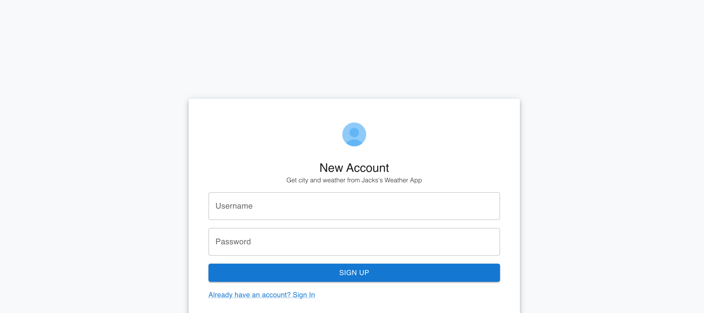
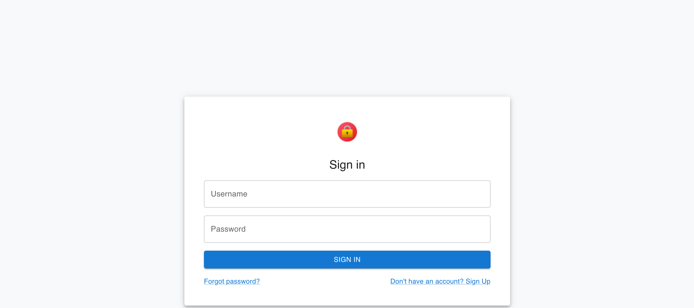

## Project Name & Pitch

Jack’s Weather Webpage 

A web application used to authenticate users and display weather information

## Project Images:

[alt_text](images/WeatherPage.png "image_tooltip")

## Installation and Setup Instructions

Clone this repository. You will need `node` and `npm` installed globally on your machine. You will also need to have docker desktop installed. If you want to use the database as a weather provider, you will also need to have postman or another application that can send http requests to a web service.

Installation:

In a terminal window, to to project root and run:

‘Npm install’

To Start Server, navigate to backend and run:

`node server.js`  

To Visit App, navigate to frontend in a different window and run:

‘Npm start’  

To start database:

In another terminal, window, navite to root of project and run: \
docker-compose -f docker-compose.yml \
 \
Then, visit: localhost:9001 and fill in the following information: \
System: postgreSQL

Server: postgres

Username: admin

Password: password

Then, create a new database called ‘weather’, and import the db.sql file, click ‘execute’, and you should have two tables, one for users and one for weather

##Reflection

This project was created to learn and apply industry standard software engineering concepts, technology, and design. I gained valuable information through implementing rest apis, user authentication, databases, front end development, and practicing good design organization. 

Rest apis

* My backend is built as a rest api, using node.js and express.js. This involved creating various endpoints to handle different types of requests.
* I have done this to provide a standardized interface for clients such as my frontend to communicate with components in my backend. 
* I have implemented 5 http methods: get, put, post, delete, and patch. Each endpoint, when called upon, will handle the request accordingly, performing operations such as updating a database with user/weather information, or getting real time weather information. 
* I have added OAS (open api spec) support to the api, the official contract can be viewed here: [https://jtabb1213.github.io/weather/#/](https://jtabb1213.github.io/weather/#/)
* I have a variety of providers set up to get information from, including a google map api, two real time weather apis, and a personal database. 

User authentication and shared caching:

* I use a postgre SQL database to store user information. 
* The reason I added this feature was purely for practice with user authentication.
* When the user attempts to login, an http request is sent to the database to confirm that the user is found, which if successful, will make a 10 minute session for the user. This allows the user to access the protected endpoints of the website
* I have also a create account endpoint, which will add user information to the database.
* Additionally, I have added shared caching, which stores the user session in a redis store. Now, if I wish to scale up my web application, users will not have any authentication issues when switching between instances of my app.

Databases:

* As mentioned earlier, I have implemented a postgre sql database in this application.
* The reason I did this was to store user and weather information, which I do so in two different tables. 
* I can update the weather table by using postman to issue api calls to an endpoint in my api.
* I use the ORM library sequelize to interact with the database, and I have created models for the city and the user. 

Good organization:

* One organization concept I tried my best to follow is the single responsibility principle.
* I have designed my backend so that each module is responsible for one thing.
* This makes it very easy to switch or add providers for the information, all you have to do is specify it in the ‘config’ file. 
* I also followed this principle to help me build a good front end. I have different components spread across multiple files, and I combine them to build a good web page. 
